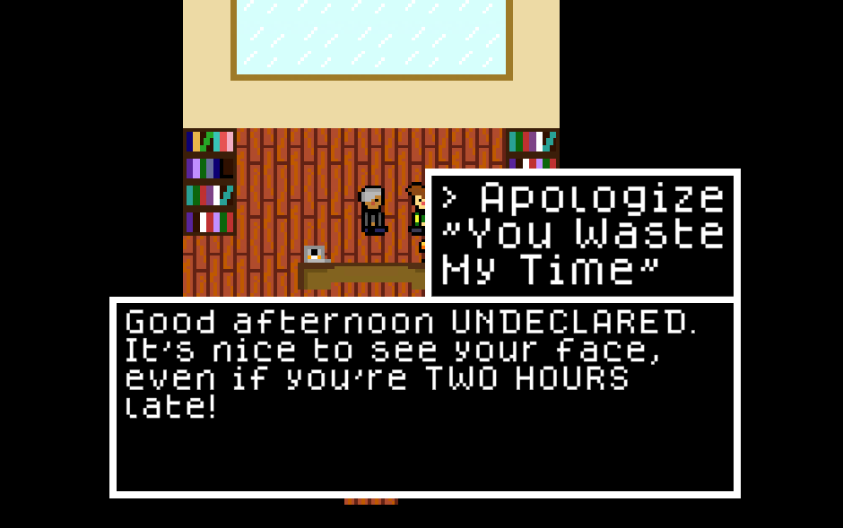

### Willem and Mike [[play the game]](https://www.playwillem.app/) [[source code]](https://github.com/tayydev/willem-and-mike)
Willem and Mike is a short top-down RPG game about a student declaring their college major at William & Mary. Willem and Mike was the first place winner of the William & Mary Cypher VIII Hackathon.

I lead a team of three in brainstorming, rapid prototyping, asset creation, and play testing. The game is built in Unity and deployed with WebGL + Github Pages (so you can play it right now from your browser!). Previous Unity leadership experience, along with some FANTASTIC teammates helped us iterate at a very effective pace.