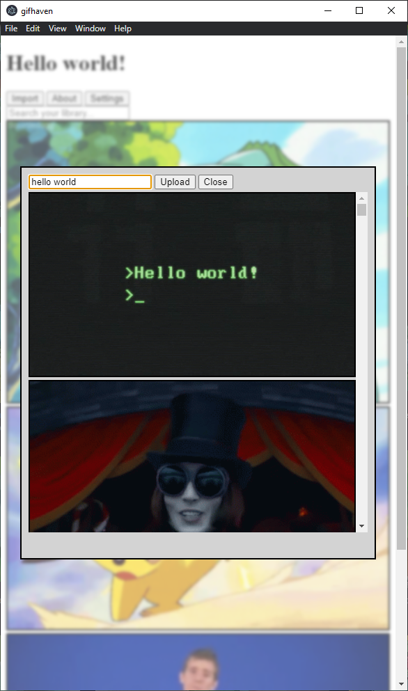

### GifHaven [[github]](https://github.com/tayydev/GifHaven)

GifHaven is a WIP tool for finding, saving, storing, and aggregating gifs.
GifHaven is being built with [Electron](https://www.electronjs.org/) and [Typescript](https://www.typescriptlang.org/) and is serving as a way for me to get my hands dirty with more interactive web design.

One of the most rewarding parts about GifHaven is that I get the "behind the curtain" experience where I choose how much customization and control I want to expose to the user.
Right now I'm focused on creating a flexible core framework that transparently communicates to users how their data is stored.
