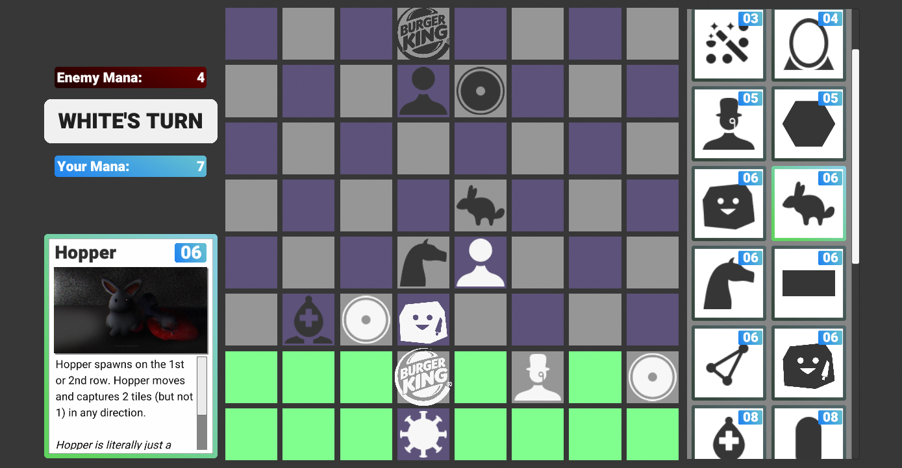

### Chess3
Chess3 is an original networked multiplayer turn-based strategy game built in [Unity](https://unity.com/) with C#.
Chess3 is a collaborative effort that is seeing active development.
I manage the project and serve as our lead engineer.
The project is organized on a private GitHub repository, and we use issues/branches extensively to manage the concurrent work of four contributors.

